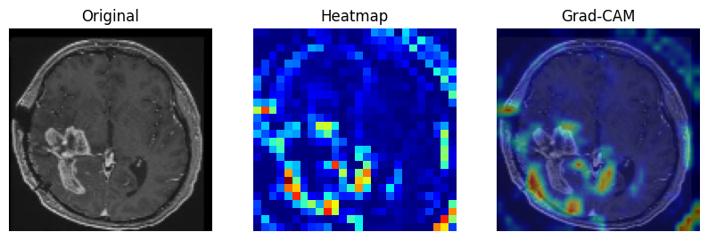
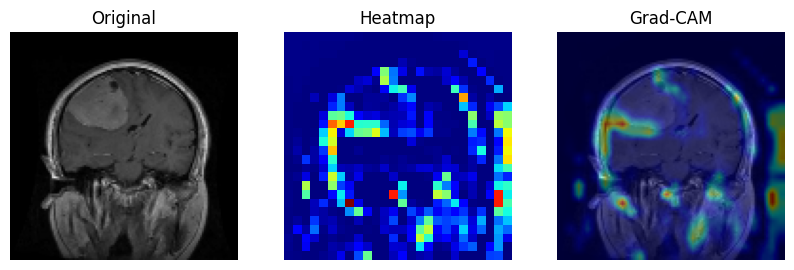
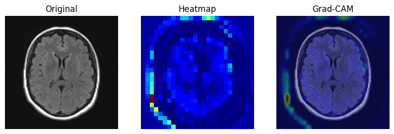
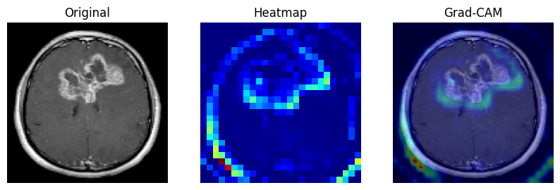

# 🧠 Brain-Tumor-CNN

A deep learning based Brain MRI classification project using a **Convolutional Neural Network (CNN)** to classify brain MRI images into four categories:

- 🧬 Glioma
- 🧠 Meningioma
- ✅ No Tumor
- 🔴 Pituitary Tumor

The project demonstrates a complete workflow including data preprocessing, CNN model development, training, evaluation, Grad-CAM visualization, and image inference.

---

# 📌 Project Overview

This project focuses on **multi-class brain tumor classification** using MRI images.  
A custom CNN model was trained to automatically identify the type of brain tumor present in MRI scans.

The system can classify MRI images into:

| Class | Description |
|---|---|
| Glioma | Tumor originating in glial brain cells |
| Meningioma | Tumor arising from meninges |
| No Tumor | Healthy MRI scan |
| Pituitary | Tumor affecting pituitary gland |

---

# 🖼️ Sample Outputs

## 🧬 Glioma vs Meningioma





---

## ✅ Tumor vs No Tumor





---

# 🚀 Features

- ✅ Multi-class brain tumor classification
- ✅ MRI image preprocessing
- ✅ CNN-based deep learning model
- ✅ ROC Curve analysis
- ✅ Confusion Matrix visualization
- ✅ Classification report generation
- ✅ Grad-CAM interpretability
- ✅ Model saving and inference system
- ✅ TensorFlow/Keras implementation

---
# 📝 Research Contribution

A research paper was also written based on this project, focusing on the complete workflow of **Brain Tumor MRI Classification using Convolutional Neural Networks (CNNs)**.

The paper explains:

- 🧠 The working principles of CNN architectures for medical image classification
- 🔍 Feature extraction and hierarchical learning in convolutional layers
- 📊 Performance evaluation using:
  - Accuracy
  - Precision
  - Recall
  - F1-Score
  - Confusion Matrix
  - ROC Curve
  - AUC-ROC Analysis
- 🔥 Grad-CAM (Gradient-weighted Class Activation Mapping) for model interpretability
- 📈 Visualization of important tumor regions influencing predictions
- 🧪 Experimental setup, preprocessing pipeline, and model training strategy
- 📂 Dataset preparation and augmentation techniques
- 📉 Analysis of classification performance across all tumor classes

The research highlights the importance of **explainable AI in medical imaging**, demonstrating how Grad-CAM improves transparency by showing which regions of MRI scans contribute most to the CNN's decision-making process.

The study also discusses the effectiveness of CNNs in accurately classifying brain tumors and compares performance using multiple evaluation metrics to ensure reliable medical image analysis.

---

# 📂 Dataset

## 📌 Brain Tumor MRI Dataset

The dataset used for this project was obtained from Kaggle.

### Classes
- Glioma
- Meningioma
- No Tumor
- Pituitary

### Dataset Structure
The dataset contains MRI images organized into class-specific folders.

---

# ⚙️ Data Preprocessing

Several preprocessing techniques were applied before training the CNN model.

## 🖼️ Image Processing
- Images loaded using `PIL.Image`
- Converted to RGB format
- Resized to **120 × 120**
- Converted to NumPy arrays

---

## 🏷️ Label Encoding
- Class labels converted into numerical labels using:
  - `LabelEncoder`

---

## 🔥 One-Hot Encoding
- Labels transformed using:
  - `to_categorical()`

---

## 📊 Normalization
Pixel values scaled from:

```python
0-255 → 0-1
```

This improves training stability and convergence speed.

---

## 📂 Dataset Split

| Dataset | Percentage |
|---|---|
| Training | 64% |
| Validation | 16% |
| Testing | 20% |

Stratified splitting was used to maintain balanced class distribution.

---

# 🧠 CNN Model Architecture

A Sequential CNN model was built using TensorFlow/Keras.

## Architecture

```python
Conv2D (32 filters) + ReLU
MaxPooling2D

Conv2D (64 filters) + ReLU
MaxPooling2D

Conv2D (128 filters) + ReLU
MaxPooling2D

Flatten

Dense (128 units) + ReLU
Dropout (0.5)

Dense (4 units) + Softmax
```

---

# 🏋️ Training Details

| Parameter | Value |
|---|---|
| Optimizer | Adam |
| Loss Function | categorical_crossentropy |
| Metrics | Accuracy |
| Epochs | 25 |
| Batch Size | 32 |

---

# 📈 Model Evaluation

The model was evaluated using multiple classification metrics.

## ✅ Test Accuracy

```text
94%
```

---

## 📊 Evaluation Metrics

- Accuracy
- Precision
- Recall
- F1-Score
- ROC Curve
- AUC Score
- Confusion Matrix

---

# 📉 ROC Curve Analysis

ROC curves were generated using a **One-vs-Rest** strategy for all four classes.

### Purpose
- Evaluate classification performance
- Analyze class-wise discrimination capability
- Measure Area Under Curve (AUC)

---

# 🔥 Confusion Matrix

A confusion matrix was generated to visualize:

- Correct predictions
- Misclassifications
- Class-specific performance

This helps identify confusion between tumor categories.

---

# 🧾 Classification Report

Detailed metrics were generated for each class:

- Precision
- Recall
- F1-score
- Support

---

# 🔍 Grad-CAM Interpretability

Grad-CAM (Gradient-weighted Class Activation Mapping) was implemented to visualize important image regions influencing predictions.

## Benefits
- Improves model interpretability
- Highlights tumor-relevant regions
- Increases trust in predictions

---

# 💾 Model Saving

The trained model and preprocessing tools were saved for future inference.

## Saved Files

| File | Purpose |
|---|---|
| `.keras` | Trained CNN model |
| `.pkl` | Serialized LabelEncoder |

---

# 🛠️ Technologies Used

- Python
- TensorFlow
- Keras
- OpenCV
- NumPy
- Matplotlib
- Scikit-learn
- PIL

---

# 📂 Project Structure

```bash
Brain-Tumor-CNN/
│
├── assets/
│   ├── glioma.png
│   ├── menin.png
│   ├── no_tumor.png
│   └── tumor.png
│
├── notebooks/
│   └── brain_tumor_classification.ipynb
│
├── models/
│   ├── brain_tumor_cnn.keras
│   └── label_encoder.pkl
│
├── README.md
└── requirements.txt
```

---

# 📊 Results Summary

| Metric | Performance |
|---|---|
| Test Accuracy | 93.48% |
| Classification Type | Multi-Class |
| Classes | 4 |
| Model Type | CNN |

---

# 🔮 Future Improvements

- 🔹 Transfer Learning (ResNet, EfficientNet)
- 🔹 Attention Mechanisms
- 🔹 Real-time MRI prediction system
- 🔹 Web deployment using Streamlit
- 🔹 Mobile-compatible inference
- 🔹 3D MRI classification

---

# 👨‍💻 Author

## Md Affan

Deep Learning & Medical Imaging Enthusiast

---

# ⭐ Acknowledgements

- Brain Tumor MRI Dataset (Kaggle)
- TensorFlow & Keras
- Open-source medical imaging community
